# 📚 Bookcore  
_A Cloud-Based Book Borrowing and Management System_


---

## 🧠 Overview

**Bookcore** is a **cloud-based book borrowing and management platform** that transforms traditional library systems into efficient, paperless digital environments.  
Developed using **React.js**, **Firebase**, and **TailwindCSS**, it provides real-time synchronization, secure role-based access, and insightful analytics for both users and administrators.

---

## 🚀 Features

- 🔐 **Secure Authentication** using Firebase Auth (User & Admin roles)  
- 🔄 **Real-Time Updates** for borrow/return transactions  
- 📊 **Admin Analytics Dashboard** with visual charts  
- ☁️ **Serverless Architecture** powered by Firebase  
- 📱 **Fully Responsive UI** built with TailwindCSS  
- 🔍 **Smart Search & Filter** for quick book discovery  
- ⚡ **Continuous Deployment** with Vercel hosting  

---

## 🧩 Tech Stack

| Layer | Technology |
|-------|-------------|
| **Frontend** | React.js (v18) |
| **Styling** | TailwindCSS |
| **Backend** | Firebase Firestore (NoSQL) |
| **Authentication** | Firebase Auth |
| **Storage** | Firebase Cloud Storage |
| **Hosting** | Vercel |
| **Testing Tools** | Jest, Lighthouse, Chrome DevTools |

---

## ⚙️ Installation & Setup

Clone and set up the project locally:

```bash
git clone https://github.com/AARTI756/bookcore
cd bookcore
npm install

🔧 Firebase Configuration
Create a Firebase project and enable:
Firestore Database
Authentication (Email/Password)
Storage
Replace your Firebase config inside src/firebase.js:

const firebaseConfig = {
  apiKey: "YOUR_API_KEY",
  authDomain: "YOUR_AUTH_DOMAIN",
  projectId: "YOUR_PROJECT_ID",
  storageBucket: "YOUR_STORAGE_BUCKET",
  messagingSenderId: "YOUR_SENDER_ID",
  appId: "YOUR_APP_ID"
};

Start the development server:


npm start
Visit: http://localhost:3000


🔒 Security
Firebase Auth tokens for session management
Firestore Security Rules for access control
HTTPS encryption
Role-based permissions for admin and users

## 📸 Screenshots

### 🔑 Login


### 🧾 Register


### 🏠 Home
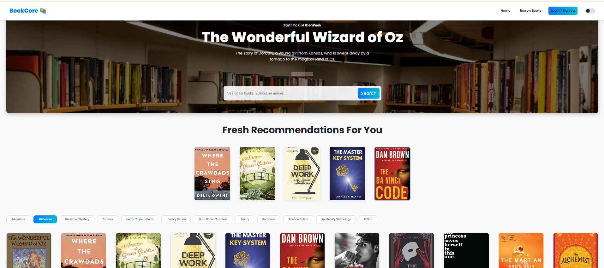
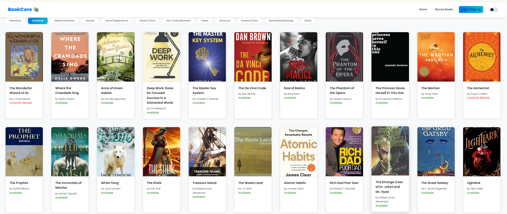
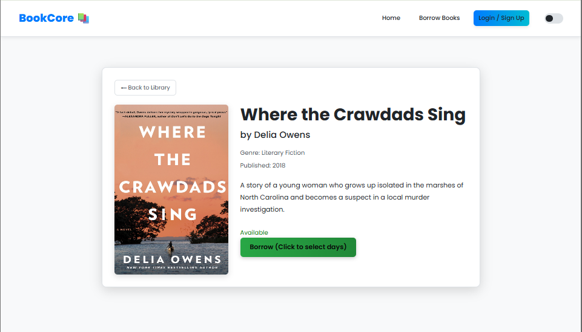
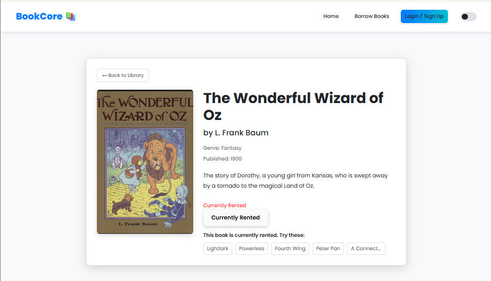

### 📚 Book List
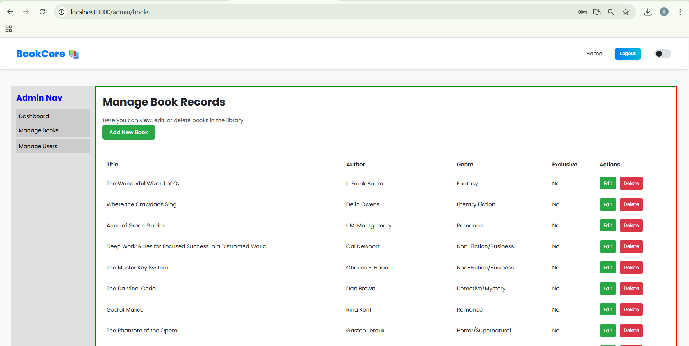

### 📖 Borrow Book

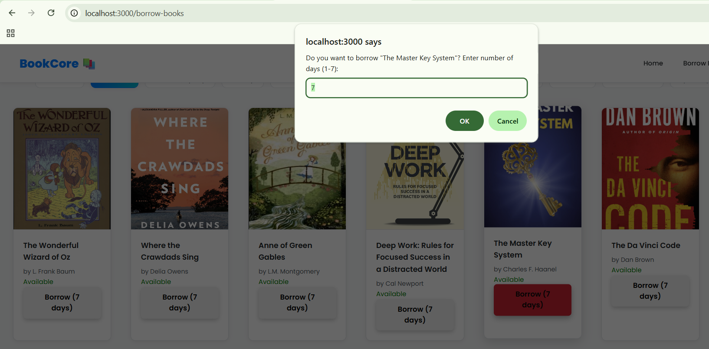
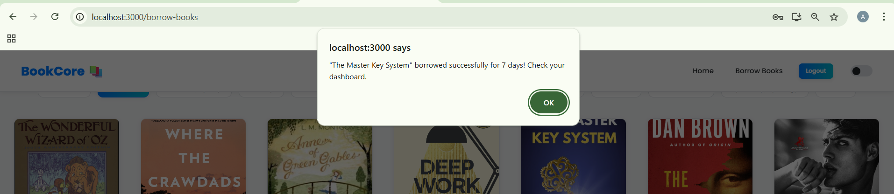

### 🔁 Return Book
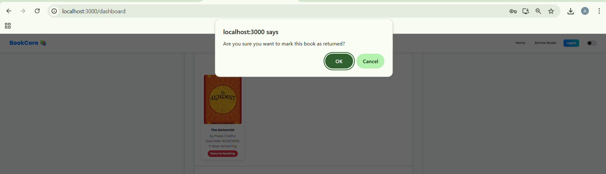

### 🧮 Admin Dashboard
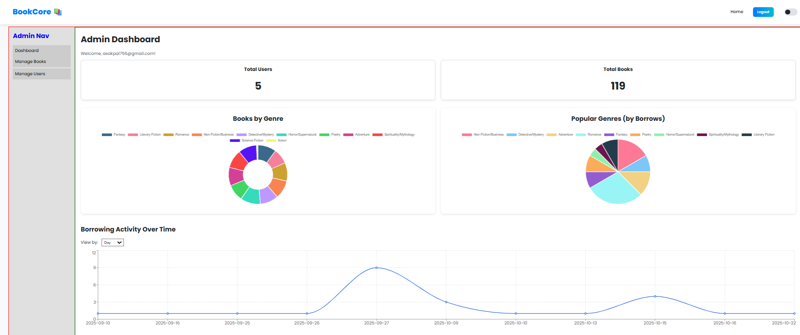
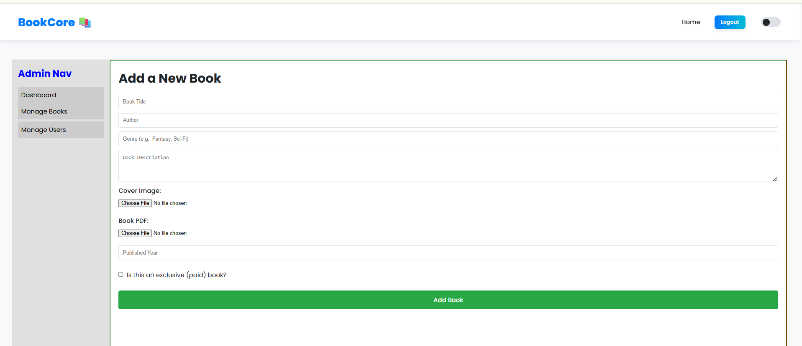

### 👤 User Profile
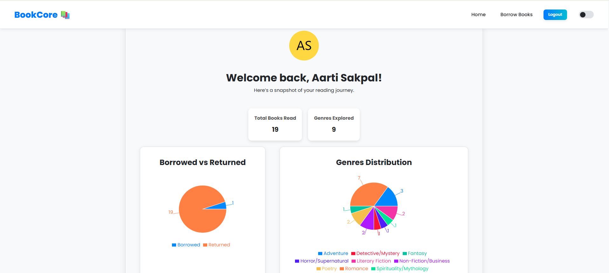
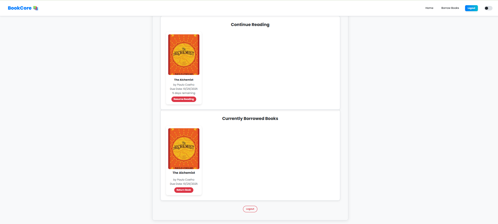
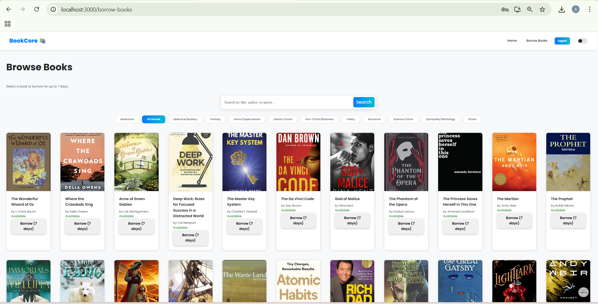
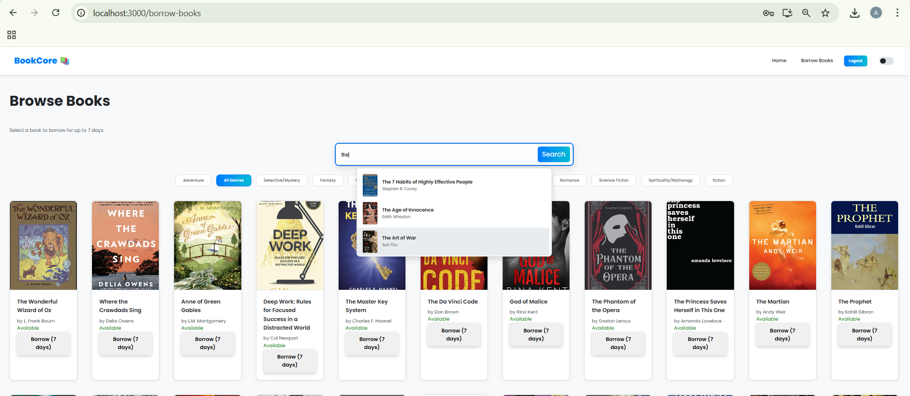
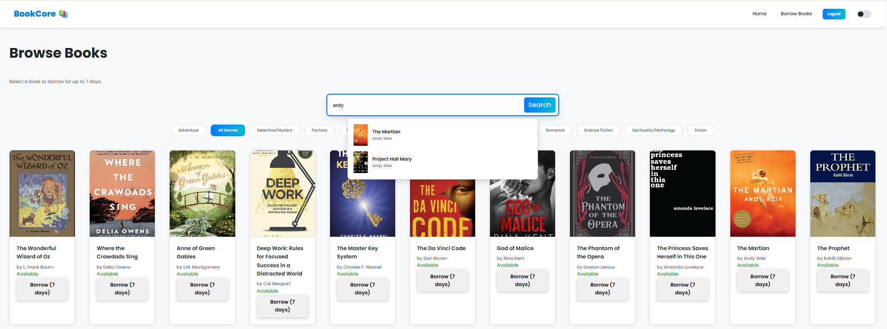
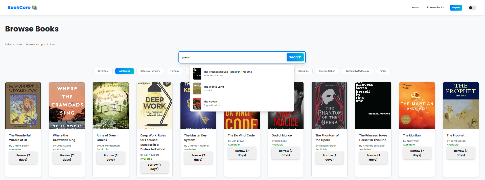


📈 Future Enhancements
🤖 AI-based Book Recommendations

🧾 QR/Barcode Borrowing System

🌍 Offline-ready PWA

🔗 Academic API Integrations

🌐 Multilingual & Accessible UI

🪙 Blockchain-enabled Borrow History

👩‍💻 Author
Aarti Sakpal
Third-Year Computer Engineering Student
Vidyalankar Institute of Technology, Mumbai, India
📧 aarti.sakpal@vit.edu.in


© 2025 Aarti Sakpal
Developed as part of the Cloud Computing and Web Technologies project at VIT Mumbai.


